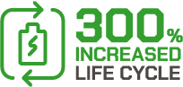

<!-- markdownlint-disable MD033 MD041 MD024 -->

---
<!-- markdownlint-disable MD045 -->

<!-- markdownlint-enable MD045 -->
---

  
  <b>Advanced bipolar architecture</b>

  
  <b>Designed for disassembly</b>

  
  <b>Low-energy, near zero-impact recycling</b>

  
  <b>Low cost, globally available materials</b>

  
  <b>Low-cost manufacturing</b>

  
  <b>Low-risk electro-chemical foundation</b>

 

Site <https://advancedbatteryconcepts.com>
